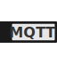

# mqttstray

*MQTT System Tray Icon*




## About

This project provides a small python script which builds system tray icons from messages on MQTT subscribtions. The icons are build combining SVG template files and the [jinja2 template](http://jinja.pocoo.org/docs/templates/) processor to render images depending on the MQTT message payload. The payload needs to be JSON encoded.

I developed *mqttstray* to get the measurements of my CGM to my GNU/Linux desktop. See also the [xDrip+](ex/xDrip/) example.


## Setup

- create a python virtual env
- install missing dependencies within the env
- create configuration file and SVG template(s)


## Configuration

The main configuration file is `${XDG_CONFIG_HOME}/mqttstray/config`.


### MQTT

The configuration file requires to contain a section for the MQTT connection:

```ini
[_MQTT]
host=127.0.0.1
port=8883
tls=True
verify=False
username=joe
password=foobar
```

The following settings are supported for the MQTT [constructor](https://pypi.org/project/paho-mqtt/#constructor-reinitialise) and MQTT [connect](https://pypi.org/project/paho-mqtt/#connect-reconnect-disconnect) invocation:
- `host` - the host used for the MQTT connection
- `port` - the port used for the MQTT connection (default: `1883`)
- `client_id` - unique client id (default: `${USER}@$(hostname -f)`)
- `transport` - *tcp* or *websockets* MQTT transport (default: `tcp`)
- `username` - MQTT authentication username (default: *None*)
- `password` - MQTT authentication password (default: *None*)

The following settings are supported for the MQTT [tls_set](https://pypi.org/project/paho-mqtt/#tls-set) invocation:
- `tls` - enable TLS for the MQTT connection (default: `False`)
- `verify` - verify the MQTT broker's X.509 certificate (default: `True`)
- `ca_certs` - pathname for the CA files (default: *system's CA list is used*)
- `certfile` - client certificate file used for authentication (default: *None*)
- `keyfile` - client private key file used for authentication (default: *None*)
- `ciphers` - restrict allowed encryption ciphers or use python's default
- `insecure` - ignore MQTT broker's X.509 certificate subject hostname (default: `False`)


### Icons

Any other section not beginning with a underscore (`_`) is handled as an icon configuration:

```ini
[xDrip mmol/l]
topic=android/broadcast/my-phone/xdrip
filename=xDrip/icon-mmol.svg
outdated=600
```

An icon section has the following options:
- `topic` - a single MQTT topic used for this icon
- `filename` - SVG filename to be used as [jinja2 template](http://jinja.pocoo.org/docs/templates/) to render the final icon


## Examples

Example icons can be found in the [ex/](ex) directory.


## Limitations

- no support for wildcard topics(, yet)
- currently only one topic per icon is supported
- only a connection to a single MQTT broker is supported
- MQTT payload requires to be JSON encoded
