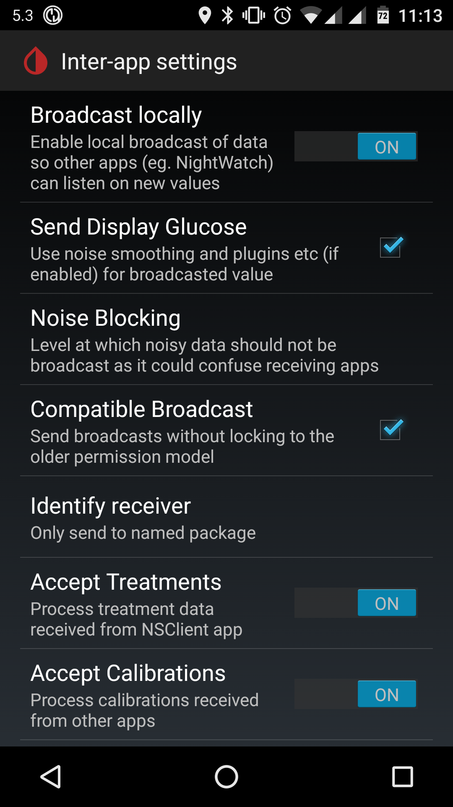
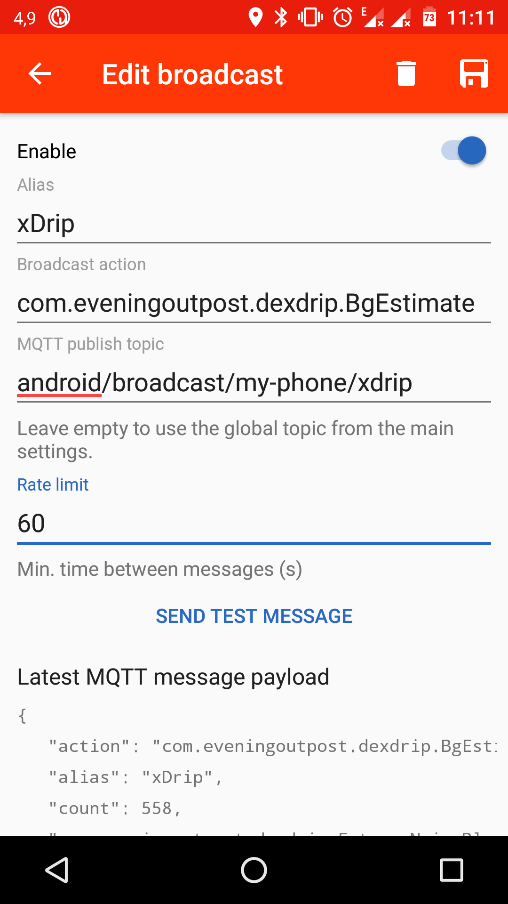

# mqttstray showing xDrip+ data

I developed *mqttstray* to get the measurements of my CGM to my GNU/Linux desktop. I use [xDrip+](https://github.com/NightscoutFoundation/xDrip) to process the CGM measurements on my Android smartphone. Using [Broadcast to MQTT](https://play.google.com/store/apps/details?id=pixento.nl.broadcasttomqtt) the measurements are published to my private MQTT broker. On my desktop systems I use *mqttstray* to show the current measurement of my CGM as a system tray icon.

## xDrip+

[xDrip+](https://github.com/NightscoutFoundation/xDrip) needs to be configured to publish CGM data using broadcast intents (*Broadcast locally*):



## Broadcast to MQTT

Create a broadcast configuration for the `com.eveningoutpost.dexdrip.BgEstimate` intent using a custom MQTT topic:



The following example shows the JSON encoded MQTT message payload published by [Broadcast to MQTT](https://play.google.com/store/apps/details?id=pixento.nl.broadcasttomqtt). This data can be used in the SVG icon template to render the *mqttstray* icon:

```json
{
   "action" : "com.eveningoutpost.dexdrip.BgEstimate",
   "alias" : "xDrip",
   "count" : 527,
   "com.eveningoutpost.dexdrip.Extras.BgEstimate" : 135.279862410944,
   "com.eveningoutpost.dexdrip.Extras.BgSlope" : -2.84868732617809e-05,
   "com.eveningoutpost.dexdrip.Extras.BgSlopeName" : "FortyFiveDown",
   "com.eveningoutpost.dexdrip.Extras.Noise" : -9999,
   "com.eveningoutpost.dexdrip.Extras.NoiseBlockLevel" : 200,
   "com.eveningoutpost.dexdrip.Extras.NoiseWarning" : 0,
   "com.eveningoutpost.dexdrip.Extras.Raw" : 135.279862410944,
   "com.eveningoutpost.dexdrip.Extras.SensorBattery" : 100,
   "com.eveningoutpost.dexdrip.Extras.SourceDesc" : "Blucon",
   "com.eveningoutpost.dexdrip.Extras.Time" : 1541120236770
}
```

## mqttstray

Use one of the following config snippets depending on your prefered measurement unit (`mmol/l` vs. `mg/dl`). *xDrip+* always publishes in `mg/dl`, the `mmol/l` SVG file has an additional convertion for the measurement value. The MQTT topic value needs to be the same as configured at the *Broadcast to MQTT* app.

```ini
[xDrip mmol/l]
topic=android/broadcast/my-phone/xdrip
filename=xDrip/icon-mmol.svg
```

```ini
[xDrip mg/dl]
topic=android/broadcast/my-phone/xdrip
filename=xDrip/icon-mg.svg
```
